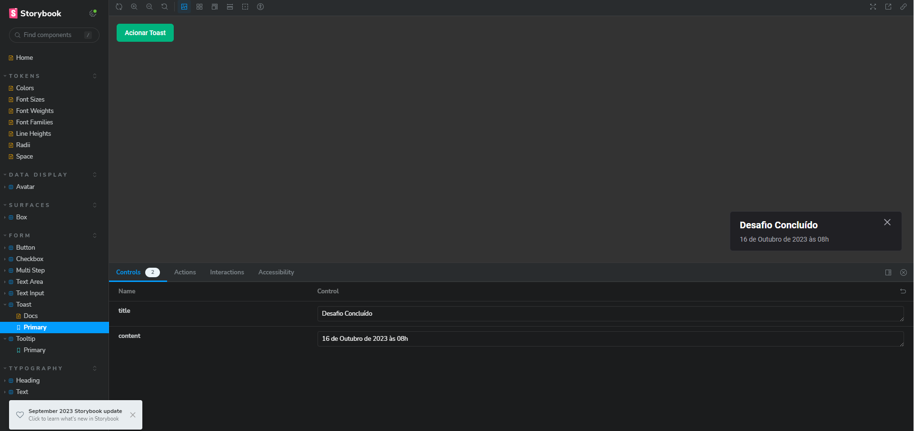
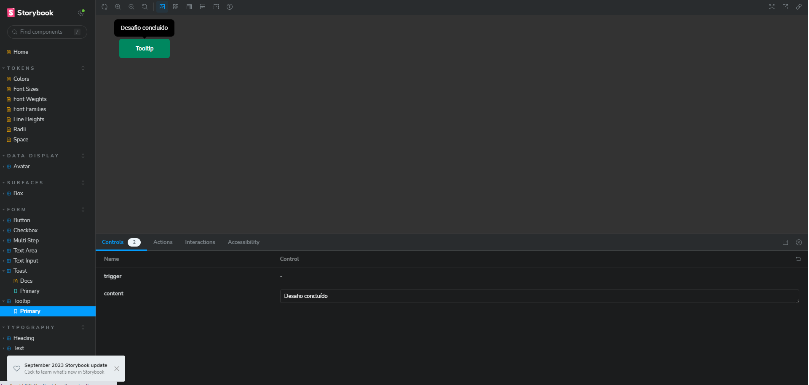

<h1 align="center"> Desafio Ignite - Design System </h1>
 

# Sobre o desafio

Nesse desafio implementamos o componente de TOAST e o componente de TOOLTIP ao Storybook

## Toast

  

## Tooltip

  

## 🚀 Tecnologias

Esse projeto foi desenvolvido com as seguintes tecnologias:

- React
- Typescript
- Stitches
- Radix-UI

## :memo: Licença

Esse projeto está sob a licença MIT.

---